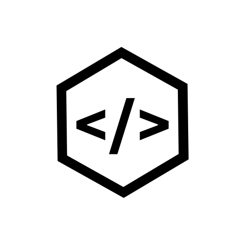

<h2 align="center">
    <a href="https://www.npmjs.com/package/dummy-code">
        
    </a>
    <br>
    Dummy Code
    <br>
</h2>

<h4 align="center">A collection of useful TypeScript functions</h4>

<p align="center">
  
  
  
</p>

<p align="center">
  <a href="#how-to-use">How To Use</a> •
  <a href="#dummy-functions">Functions</a> •
  <a href="#contributing">Contributing</a>
</p>

## How To Use

Install the latest version of the package using yarn:

```bash
yarn add dummy-code@latest
```

or, if you prefer npm:

```bash
npm install --save dummy-code@latest
```

Now, you can import the functions you need:

```typescript
import { ConvertDecimalToBinary } from "dummy-code";
```

Example:

```typescript
import { ConvertDecimalToBinary } from "dummy-code";

let decimal = 10;

let binary = ConvertDecimalToBinary(decimal);

console.log("The Binary conversion of " + decimal + " is " + binary);
```

## Dummy Functions

You can find the list of all the functions in the [FUNCTION.md](FUNCTION.md) file.

## Contributing

If you want to contribute to this project, please read the [CONTRIBUTING.md](CONTRIBUTING.md) file.

<table>
  <tr>
    <td>
    
    <h3>Thanks for contributing :purple_heart:</h3>
    <ul>
      <li>Thanks for all your contributions and efforts</li>
      <li>We thank you being part of our :sparkles: commUnity :sparkles: !</li>
    </ul>
    
    </td>
  </tr>
</table>

## Join us in discussions

We use GitHub Discussions to talk about all sorts of topics related to documentation and this project. For example: if you'd like help troubleshooting a PR, have a great new idea, or want to share something amazing, join us in the [discussions][11].

---

<p align="center">
Made with 💖 by Codinasion
</p>

---

[11]: https://github.com/orgs/codinasion/discussions "Discussions"
